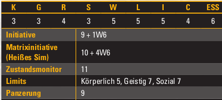
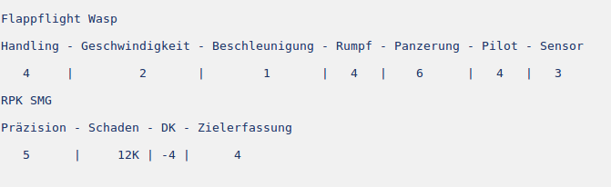

# Künstliche Intelligenz

Die Münchner Regierung will zeigen, dass sie die Neuerungen der Zeit nicht
verschlafen haben. Auf einer Technikmesse zeigen sie eine Zweibeinige
Service-Drohne, der imp-erial1, die der neue Coup in der
High-Society-Dienstleistungsbranche werden soll.

Die Entwicklung des imp-erial1 ging völlig geheim vonstatten, auf der Messe
wurde er plötzlich präsentiert und hat die Konkurrenz völlig überrascht.
Öffentlichkeitswirksam lassen sich nun einige Promis mit dem neuen Roboter
ablichten, und er ist sofort eine Starmaschine geworden.

Noch während der zweitägigen Messe werden die Runner überstürzt angeheuert, um
den Roboter öffentlichkeitswirksam zu stehlen. NeoNet aus Nürnberg ist die
ungewöhnliche Stärke des Pilotprogramms der Drohne aufgefallen, und sie wollen
sie reverse-engineeren. Also beauftragen sie die Runner, die Drohne zu
kidnappen.

Was NeoNet nicht weiß - die Entwicklung der KI vom imp-erial1 war deswegen so
leise, weil die Drohne gar nicht autonom agiert. Im Inneren steckt ein Gnom und
bedient den Roboter manuell - deswegen kann er auf ungewöhnliche Befehle
reagieren, deswegen wirkt er so elegant und dynamisch. Ob die Runner das
rechtzeitig merken?

## Treffen mit Frau Schmidt

* Es ist Samstag, der 26.1.2075.
* Der Nürnberger Christkindlesmarkt wurde bis in den Januar verlängert, damit
  er mehr Profit abwirft.
* Verschiedene Stände preisen Lebkuchen, Glühwein, und tragbaren Schnee an
* Zwei Elfen stehen vor der Lorenzkirche und haben einen kleinen Stand
  aufgebaut. Sie preisen kleine Spielzeuge an. Sie blinken, man kann sie in die
  Luft werfen, und sie segeln dann langsam runter. Nach ein paar Minuten kommt
  der Sternschutz an und nimmt sie fest, weil sie keine Genehmigung haben.
* An einem Glühweinstand steht eine Frau mit dicker Winterjacke, die eine SIN
  mit Namen "Schmidt" ausstrahlt
* Wahrnehmung (3): 2 Trolle halten sich in der Nähe, vermutlich Leibwächter

Frau Schmidt ist eine relativ große Elfe mit braunen Haaren. Als ihr euch zu
erkennen gebt, gibt sie euch einen Glühwein aus, und geht mit euch ein paar
Schritte zur Lorenzkirche hin. Sie spannt einen Regenschirm mit eingebautem
Geräuschfilter auf und erklärt euch den Run:

* In München ist dieses Wochenende die Drone-Clone Messe - ein riesiges
  Business-Event der Drohnenindustrie.
* Es gibt einen unerwarteten Star auf der Messe, eine neue Service-Drohne.
* Die hat die Stadt München wohl selbst entwickelt, im Geheimen. Scheint eine
  sehr gute KI zu sein, die sehr kreativ und dynamisch auf neue Umgebungen und
  Aufgaben reagiert.
* Wir wollen diese Drohne reverse-engineeren, um an ihr Pilotprogramm zu
  kommen. Wir konnten aber nicht herausfinden, wo sie hergestellt wurde, oder
  wohin sie nach der Messe wieder verschwindet.
* Es ist also dringend wichtig, dass ihr die Drohne noch während der Messe
  kidnappt, also spätestens morgen.
* Bringt sie anschließend wieder nach Nürnberg in den Hafen, von dort kann ich
  sie entgegennehmen.
* Dafür bekommt ihr insgesamt 60k Nuyen.

Durch 2 Nettoerfolge im Verhandeln gegen ihren Würfelpool von 12 lässt sie sich
auf 80k Nuyen hochhandeln.

Wenn die Runner noch länger bleiben, können sie beobachten, wir Frau Schmidt
und die beiden Trolle von einem NeoNet-Firmenwagen abgeholt werden.

## Beinarbeit

Drone-Clone Messe
* Matrixsuche
  * 0: Vorschläge, wie man Bienen-Drohnen klonen kann. Der Erfolg soll bei bis
    zu 80% DNA-Übereinstimmung liegen, ist aber schwer zu messen.
  * 1: Findet in der Messe München statt. Eine Karte kostet 250 Nuyen pro
    Person.
  * 2: Nur die Hallen A1, A2, B1, B2, C1, und C2  werden für die Messe
    verwendet.
  * 3: Ihr findet folgende Beschreibung:

```
18 ebenerdige, behindertengerechte Messehallen
200.000 m² Ausstellungsfläche
säulenfreie Bauweise für maximale Flexibilität bei Auf- und Abbau
11 bis 16 Meter Raumhöhe
modernes, helles und transparentes Ambiente
50 hallennahe Besprechungsräume
```

  * 4: Grundriss der Messehalle
* Business-Connections
  * 2: Da werden neben Service- und Smarthome-Drohnen durchaus auch
    Kampfdrohnen ausgestellt.
  * 4: Ja, auf der Messe war ich schon mal. Wenn ich da mal Ruhe wollte, bin
    ich bei B1 durch so eine Tür und eine Treppe und dann in den zweiten Stock
    gegangen, da gibt es nen Balkon, wo man alleine ist und etwas frische Luft
    schnappen kann.

imp-erial1
* Matrixsuche
  * 0: Die Matrix ist voll mit Werbung, aber keine betrifft den imp-erial1.
  * 1: Ganz viele Selfies von Filmstars mit dem imp-erial1. (Fotos)
  * 2: Das besondere an dem imp-erial1 ist die KI. Der Roboter kann sehr
    ungewöhnliche Befehle verstehen. Alle Besucher sind eingeladen, ihm
    Anweisungen zu geben, die nicht einprogrammiert sind.
  * Wahrnehmung (4): Der Roboter wirkt sehr lebensnah, tanzt, und macht
    generell viele unnötige Bewegungen, die rein funktionale Maschinen oft
    vermeiden.
  * 4: Jemand in einem Spezialistenforum schreibt: Der Roboter muss anscheinend
    alle 2 Stunden aufgeladen werden. Da verschwindet er dann immer in einem
    Backstage-Raum. (Wahrnehmung 2): Auf dem Foto von der Backstage-Tür ist die
    Zahl "B1" zu erkennen.
* Connections:
  * 2: Ziemlich verrückt für eine Stadt, mit den Tech-Konzernen in den
    Wettbewerb zu treten. Aber was tun die nicht alles für ein paar
    Wählerstimmen.

Stadt München
* Matrixsuche
  * 2: Die Schwarzen Sherrifs, das Polizeiunternehmen in München, besteht aus
    wirklich ekligen Rassisten. 
* 3: 2075 stehen in München Wahlen an.
Connections:
  * 4 (kulturell)(nur unter Zwergen): Vor 2 Monaten hat die Stadt München
    Schauspiel-Castings nur für Zwerge ausgeschrieben. Es wurde aber nie etwas
    derartiges aufgeführt.

## Bei der Messe

Die Messe glänzt in der Wintersonne. Schon von außen seht ihr, wie geschäftig
es heute zugeht. Lange Schlangen stehen am Eingang, Werbedrohnen fliegen umher
und beobachten die Umgebung sehr genau. Die Presse ist da und interviewt Leute,
die in der Schlange stehen.

Das Catering wird von der Firma Dallmayr bereitgestellt, um die Sicherheit
kümmern sich die schwarzen Sherriffs. Der Sicherheitsdienst ist sichtbar, aber
stilvoll vercybert. Sie unterziehen die Besucher und ihr Ticket einem kurzen
Matrixcheck und lassen sie dann durch.

* Halle C1: Kampfdrohnen
* Halle C2: Flugdrohnen
* Halle B1: Service-Drohnen
* Halle B2: Drohnen, die nicht nach Drohnen aussehen
* Halle A1: Medizinische Drohnen
* Halle A2: Produktionsdrohnen

### SL-Wissen 

Im imp-erial1 steckt Rainer Klemm, ein Gnom und erfolgloser Schauspieler.
Durch einen Missbrauchsskandal wurde er untragbar und bekam keine Rollen mehr.
Hierfür wurde er gecastet, weil er ja eh nicht offen auftreten soll.

Die Aura von Rainer wird durch einen der Magier maskiert. Zum durchschauen der
Maske: Askennen (Schwellenwert 3).

Der imp-erial1 ist ein Matrixgerät, durch das Rainer mit der Umwelt
interagieren kann. Er hat einen Bildschirm, auf dem ein Smiley Emotionen
anzeigt, die von Rainers Gesicht abgelesen werden. außerdem 2 Arme und 2
Beine. Der Roboter ist ca. 1,20m groß und (mit Rainer) 80kg schwer.

Das Gerät kann als Kommlink Stufe 5 behandelt werden. Damit steht Rainer mit
seinem Manager im Kontakt, um auf unvorhergesehene Sachen reagieren zu können.
Die Aufnahmen/Chatlogs auf dem Gerät beweisen den Betrug.

Der imp-erial1 fährt in Halle B1 durch die Gegend. Alle 2 Stunden verschwindet
er im Backstage, um etwas zu trinken, zu essen, und zu pinkeln.

Sein Manager steht am Stand der Stadt München in Halle B1 und preist ihn an.
Zu jeder vollen Stunde führt er auf einer Bühne einen Tanz auf. Danach erledigt
er komplexe Aufgaben, die Besucher ihm auftragen können.

Magnus Sünder, sein Manager, hat ein Kommlink Stufe 7 mit heißem Sim-Modul.
Auch auf dem Kommlink findet man natürlich Beweise für die Kooperation mit
Rainer, außerdem, dass der OB der Stadt München die ganze Sache in Auftrag
gegeben hat. 



### Security

Da die Messe von der Stadt München organisiert wird, kümmern sich die schwarzen
Sherrifs um die Sicherheit. 

Die Backstage-Türen sind in der Regel mit einem Magschloss Stufe 2 gesichert.

Der Sicherheitsdienst patrouilliert über das ganze Gelände, insgesamt locker
200 Leute. Einlass gibt es am Haupteingang im Westen und am Parkhaus im
Nordwesten. Werte: Schutzpolizist (ADL S. 158)


Wenn es zu Problemen kommt, rückt nach ca. 5 Minuten auch die härtere
Eingriffstruppe an. Sie sind zu sechst und gut eingespielt. Werte:
MET2000-Söldner (ADL S. 161)


Für Magische Sicherheit sehen alle 10 Minuten 2 Magier im Astralraum nach, ob
etwas ungewöhnliches passiert. 1 Watcher pro Messehalle beobachtet die Gäste.

Die Magier haben einen Feuergeist der Stufe 6 zur Verfügung, den sie
herbeizitieren, wenn es hart auf hart kommt.


Kampfdrohnen werden in der Halle C1 ausgestellt. In der Halle sind 8
einsatzbereite Drohnen, alle nicht im Host:

* 1 Steel Lynx (GRW 473) mit 6 Anti-Fahrzeugraketen und einem Aztechnology
  Striker
  * Präzision 5, 24K Schaden, -10DK gegen Fahrzeuge, -4DK gegen andere Ziele
  * Panzerung 12, Rumpf 6, erstaunlich schnell und wendig, passt nicht durch
    die Türen
* 3 Flappflight Wasp Rotordrohnen
* 4 Flappflight Watchman Wachdrohnen




Außerdem steht in Halle C2 ein Flappflight 1 Hubschrauber herum. Er wurde
wahrscheinlich durch die Dachluke eingeflogen. Sie ist jetzt geschlossen.

### Matrix

* Host sieht aus wie ein futuristisches Raumschiff
* etwas zu viel Werbung: Kleine Bildschirme fliegen umher (Sponsoren,
  Aussteller, etc.)
* IC in Form von kleinen putzigen Aliens mit Tentakeln

Stufe 5 6587 Host für die Messe + Sicherheitssystem
* IC
  * Patrouille (Alien mit 3 Augen)
  * Aufspüren (ein großes Stielauge)
  * Killer (viele Arme, Säuredrüsen spritzen Giftwolken)
  * Marker (4 lange Arme, die eine Marke als Abdruck hinterlassen)
* Dateien
  * Liste der Aussteller (ohne Marke lesbar)
  * Liste der Besucher (Verschlüsselt Stufe 2)
  * Notausgänge (ohne Marke lesbar)
  * Gebäudeplan 
  * Standort der Securitys
  * Gästeliste
* Geräte
  * Kameras (stufe 3)
  * Dachluke (stufe 1)
  * Magschlösser (Stufe 2)
  * imp-erial1 (Stufe 5)

## Kidnapping

Wenn man den Roboter packt und mitnimmt, fängt Rainer zu schreien an. Wenn die
Runner 2 Erfolge auf Wahrnehmung haben, werden sie das merken und sich wundern
(wenn Zivilisten da sind, ist die Probe um 2 erschwert).

Früher oder später werden sie merken, dass sie einen Metamensch gekidnappt
haben, evtl weil gelbe Flüssigkeit aus dem Roboter läuft.

## Belohnung

Am Sonntagabend kriegt einer der Runner einen Anruf, dass "seine Freundin" ein
Date mit ihm ausmachen will. Die Adresse ist ein Lagerhaus am Nürnberger Hafen.
Gegenüber parkt ein Wagen von NeoNet. Drinnen wartet Frau Schmidt mit ihren 2
Trollleibwächtern.

Frau Schmidt wird behaupten, ohne die KI haben die den Auftrag nicht erfüllt
und keinen Lohn verdient.

Wenn die Runner es schaffen, ihr den Nutzen klarzumachen, erklärt sie sich
bereit, die Hälfte zu zahlen. Dafür müssen sie mindestens 2 Sachen erfüllen:
* Den schlechten Ruf von Rainer
* Dass sie wissen, dass sie für NeoNet arbeiten
* Rainer mitbringen
* Chatlogs mitbringen, die die Kommunikation mit dem OB belegen

Wenn den Runnern zusätzlich eine vergleichende Probe auf Verhandeln gelingt,
zahlt sie den ursprünglichen Lohn.

